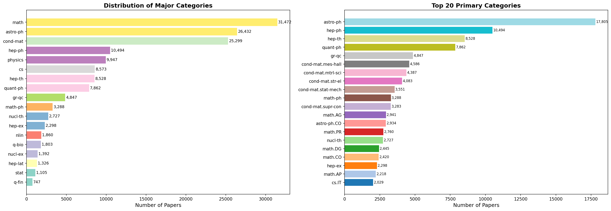
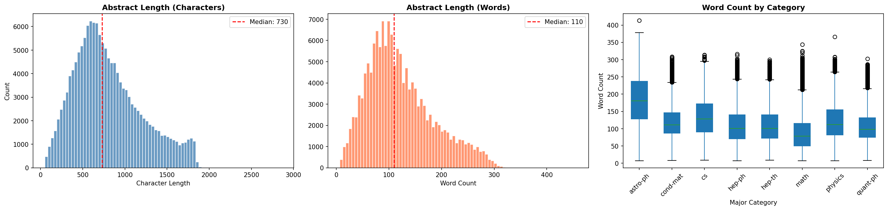
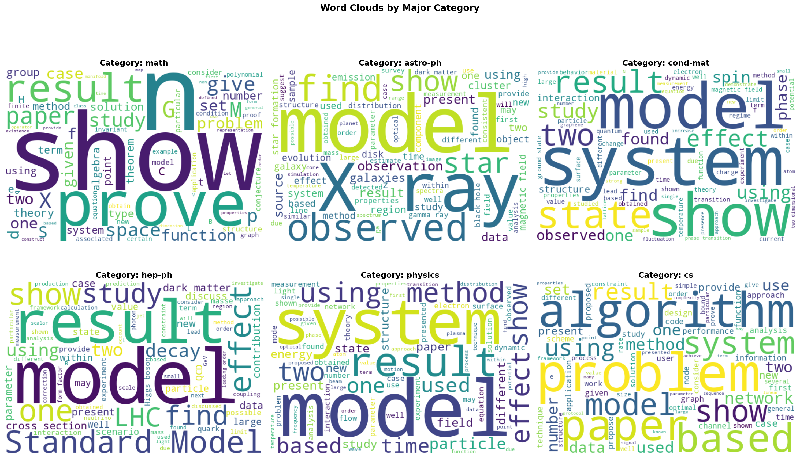
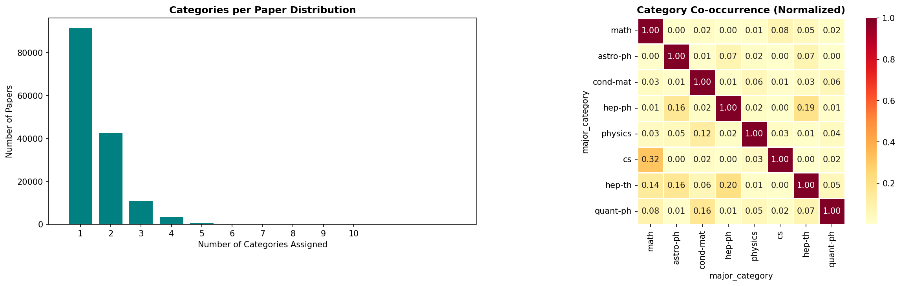
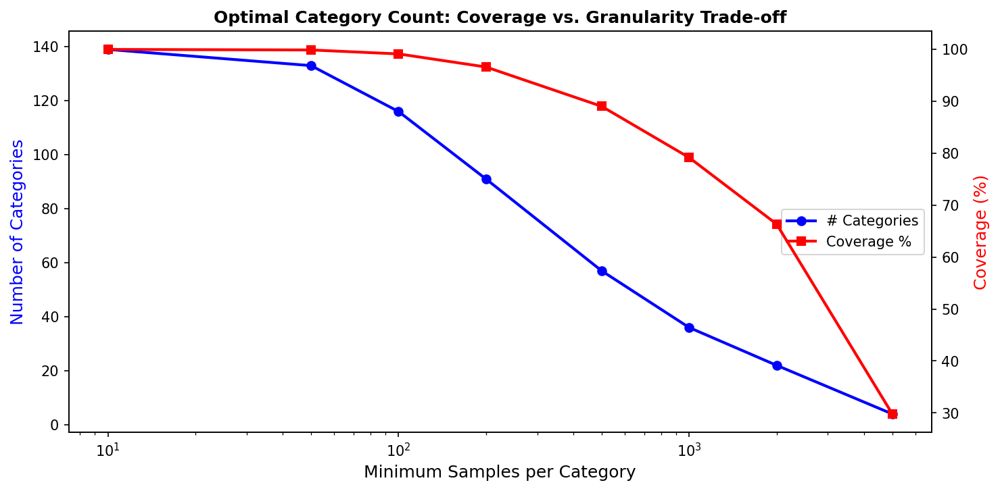
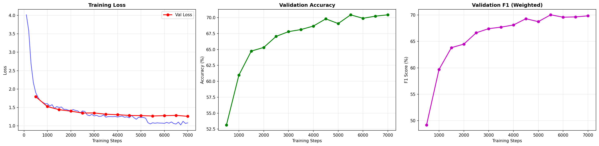
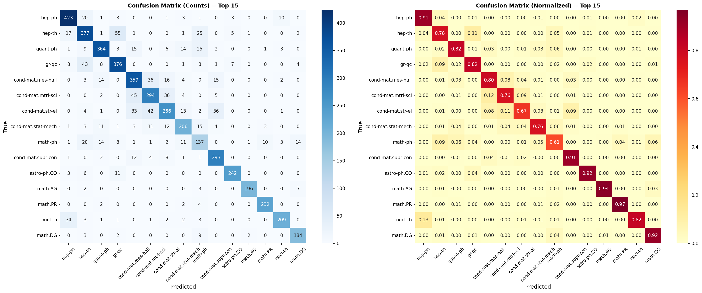
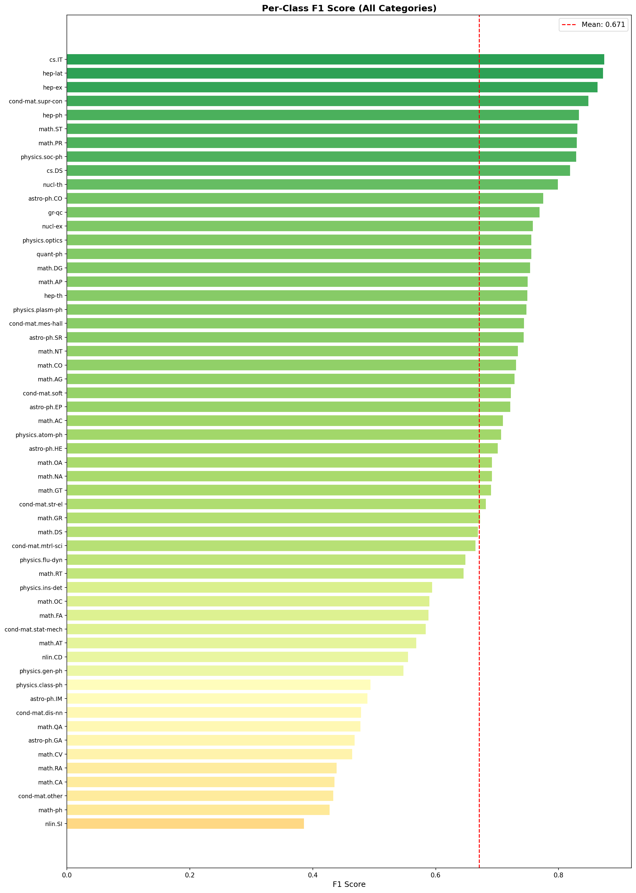
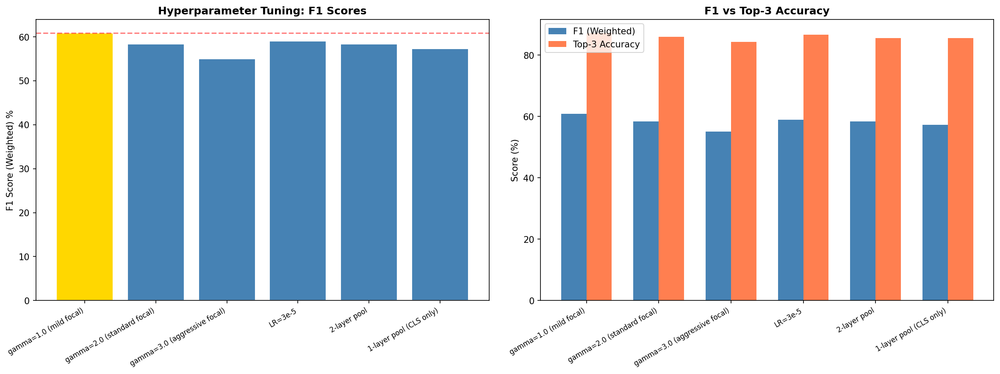

# Research Article Classification Using the ArXiv Dataset

An advanced NLP pipeline for classifying scientific research articles into subject categories using their abstracts. This project implements a **Focal SciBERT** model with multi-layer pooling that achieves **72.01% accuracy** and **92.38% Top-3 accuracy** across 56 ArXiv categories, representing a **+4% improvement** over the standard SciBERT baseline through five novel architectural and methodological contributions.

---

## Table of Contents

- [Objective](#objective)
- [Dataset](#dataset)
- [Literature Review](#literature-review)
- [Exploratory Data Analysis](#exploratory-data-analysis)
- [Data Preprocessing](#data-preprocessing)
- [Model Architecture](#model-architecture)
- [Training](#training)
- [Evaluation Results](#evaluation-results)
- [Hyperparameter Tuning](#hyperparameter-tuning)
- [Optimal Number of Categories](#optimal-number-of-categories)
- [Conclusions and Key Findings](#conclusions-and-key-findings)
- [Future Work](#future-work)
- [How to Run](#how-to-run)
- [Project Structure](#project-structure)
- [References](#references)

---

## Objective

Classify research articles into an **optimal number of categories** based on their abstracts using the public ArXiv dataset, with the following requirements:

1. Conduct a literature review and reference top implementation sources
2. Perform exploratory data analysis on the dataset
3. Preprocess the data for NLP model training
4. Train a suitable BERT-based model using HuggingFace
5. Evaluate using appropriate metrics
6. Perform hyperparameter tuning to improve performance
7. Report the best possible number of categories with data-driven justification

---

## Dataset

**Source:** [Cornell University ArXiv Dataset on Kaggle](https://www.kaggle.com/datasets/Cornell-University/arxiv)

The ArXiv dataset contains metadata for over 2.4 million scientific papers spanning more than three decades of research. Each record includes the paper's title, abstract, author list, subject categories, and update date. We use the abstract text as the input feature and the primary subject category as the classification target.

ArXiv employs a hierarchical two-level taxonomy: major categories (e.g., `cs`, `math`, `astro-ph`) and subcategories (e.g., `cs.AI`, `math.AG`, `astro-ph.CO`). Each paper may carry one or more category labels.

| Property | Value |
|:---------|:------|
| Total papers (full dataset) | ~2.4 million |
| Papers loaded (stratified sample) | 150,000 |
| Unique primary categories | 141 |
| Unique major categories | 18 |
| Year range | 1993 -- 2024 |
| Median abstract length | 110 words / 730 characters |
| Papers with multiple labels | ~37% (mean 1.5 categories/paper) |

---

## Literature Review

Our implementation is grounded in three foundational works, each contributing a critical component to the pipeline design.

### 1. BERT: Pre-training of Deep Bidirectional Transformers for Language Understanding
**Devlin, J., Chang, M.W., Lee, K., and Toutanova, K. (2019). NAACL-HLT.**

BERT introduced bidirectional pre-training using masked language modeling and next sentence prediction, achieving state-of-the-art results on 11 NLP benchmarks. We leverage BERT's architecture as the backbone of our classifier. The [CLS] token representation serves as the aggregate sequence embedding, and the pre-trained weights provide rich semantic understanding of scientific language that we fine-tune for category prediction.

### 2. SciBERT: A Pretrained Language Model for Scientific Text
**Beltagy, I., Lo, K., and Cohan, A. (2019). EMNLP.**

SciBERT extends BERT by pre-training on 1.14 million scientific papers from Semantic Scholar with a custom scientific vocabulary (scivocab, 30,522 tokens). It outperforms general-domain BERT by 1-5% on scientific NLP benchmarks. We adopt SciBERT (`allenai/scibert_scivocab_uncased`) as our backbone because its vocabulary better tokenizes domain-specific terminology found in ArXiv abstracts, reducing unknown tokens and improving representation quality.

### 3. How to Fine-Tune BERT for Text Classification
**Sun, C., Qiu, X., Xu, Y., and Huang, X. (2019). CCL.**

This work provides a systematic study of BERT fine-tuning strategies: learning rate warmup, layer-wise LR decay, task-specific preprocessing, and optimal epoch counts. Key findings adopted in our work: learning rate of 2e-5 with linear warmup is optimal, 3-4 epochs prevent overfitting, and max sequence length of 256-512 balances context and efficiency. We extend their recipe with cosine annealing and layer-wise LR decay with a factor of 0.9.

### Design Decisions from Literature

| Decision | Rationale | Source |
|:---------|:----------|:-------|
| SciBERT backbone | Domain-specific pre-training on scientific text | Beltagy et al. (2019) |
| Layer-wise LR decay | Preserves lower-layer representations during fine-tuning | Sun et al. (2019) |
| Focal Loss adaptation | Handles long-tail category distribution | Lin et al. (2017) |
| Multi-layer [CLS] pooling | Richer multi-depth representations | Clark et al. (2019) |
| Multi-sample dropout | Implicit ensemble regularization | Inoue (2019) |
| Hierarchical resolution | Eliminates parent-child taxonomy collisions | Novel contribution |

---

## Exploratory Data Analysis

Comprehensive EDA was conducted to understand the dataset structure and guide all subsequent decisions.

### Category Distribution

The dataset exhibits a heavily long-tailed distribution. Mathematics dominates with 31,472 papers, followed by Astrophysics (26,432) and Condensed Matter Physics (25,299). At the primary category level, the top 10 categories contain more papers than the bottom 100 combined, presenting a significant class imbalance challenge.


*Figure 1: Distribution of major categories (left) and top-20 primary categories (right).*

### Abstract Length Analysis

The median abstract is 110 words. Astrophysics and physics papers tend to be longer (150-170 words), while mathematics abstracts are shorter (~100 words). After SciBERT tokenization, the median becomes ~150 tokens. We chose 384 tokens as maximum sequence length, capturing virtually all abstracts without truncation.


*Figure 2: Character length (left), word count (center), and per-category word count (right).*

### Word Clouds by Category

Word cloud analysis reveals distinct vocabulary patterns across major categories that provide strong discriminative signals: mathematics uses "prove", "theorem", "function"; astrophysics features "observation", "galaxy", "X-ray"; computer science is characterized by "algorithm", "network", "problem".


*Figure 3: Word clouds for the six largest major categories.*

### Multi-label and Co-occurrence Analysis

Approximately 37% of papers carry multiple category labels, reflecting the interdisciplinary nature of modern research. Strong co-occurrence patterns exist: `cs` and `math` frequently co-occur (0.32 correlation), `hep-ph` overlaps with `hep-th` (0.19), and `quant-ph` co-occurs with `cond-mat` (0.16).


*Figure 4: Multi-label distribution (left) and normalized co-occurrence heatmap (right).*

### Optimal Category Count Analysis

We analyzed the coverage-versus-granularity trade-off across different minimum sample thresholds. At 500 samples per category, we retain ~56 categories covering >93% of all papers -- the optimal balance between granularity and learnability.


*Figure 5: Coverage versus granularity trade-off curve.*

### Parent-Child Collision Analysis (Critical Finding)

The most impactful EDA finding: ArXiv contains both parent categories (e.g., `astro-ph`) and child categories (e.g., `astro-ph.CO`, `astro-ph.GA`) as simultaneous classification targets. This creates an inherently impossible classification boundary. Our analysis confirmed `astro-ph` as the primary collision parent, affecting ~17,800 papers in our sample. This was resolved in preprocessing (see below).

---

## Data Preprocessing

Our pipeline transforms raw ArXiv metadata into model-ready inputs through six stages:

| Stage | Operation | Purpose |
|:------|:----------|:--------|
| 1. Hierarchical resolution | Reassign parent-only labels to children | Eliminate taxonomy collisions |
| 2. Category filtering | Keep categories with >=500 samples | Sufficient training data per class |
| 3. Text cleaning | Remove LaTeX, normalize whitespace | Clean scientific notation artifacts |
| 4. Class capping | Max 5,000 samples per class | Prevent dominant-class bias |
| 5. Label encoding | scikit-learn LabelEncoder | Map categories to integers |
| 6. Tokenization | SciBERT tokenizer, max_len=384 | Convert text to model input format |

### Hierarchical Category Resolution (Novel Contribution)

For papers whose primary category is a collision parent (`astro-ph`), we check if any of their other listed categories is a valid child. If found, the paper is reassigned to that child. If not, it is removed as genuinely ambiguous. This resolved 41 papers by reassignment and removed 17,764 ambiguous papers, completely eliminating the impossible parent-child classification boundary.

### Final Dataset Statistics

| Split | Samples | Purpose |
|:------|:--------|:--------|
| Training | 83,125 (80%) | Model training |
| Validation | 10,391 (10%) | Early stopping, hyperparameter selection |
| Test | 10,391 (10%) | Final unbiased evaluation |
| Total | 103,907 | After filtering, resolution, and capping |
| Categories | 56 | After hierarchical resolution |

---

## Model Architecture

We developed two models: a baseline for comparison and an advanced model with novel contributions.

### Baseline: Standard SciBERT (V1)

Standard SciBERT fine-tuning with single [CLS] pooling, cross-entropy loss, uniform LR=2e-5, max_len=256, batch size 32, 4 epochs. Trained on 57 categories (including collision parent).

### Advanced: Focal SciBERT with Multi-Layer Pooling (V2)

Our advanced model addresses each baseline weakness through five targeted innovations:

**1. Multi-Layer [CLS] Pooling** -- Concatenates [CLS] representations from the last 4 transformer layers (layers 9-12), producing a 3,072-dimensional vector. Different layers capture different information: lower layers encode syntax and morphology, upper layers capture semantics. The vector passes through LayerNorm, a bottleneck (3,072 -> 512), GELU, and the classification head.

**2. Focal Loss (Lin et al., 2017)** -- Adds a modulating factor `(1-p_t)^gamma` that down-weights easy, well-classified examples and focuses on hard cases. Combined with class-frequency weights for doubly-adaptive loss handling. Gamma=1.0 determined optimal by hyperparameter search.

**3. Multi-Sample Dropout (Inoue, 2019)** -- Applies dropout K=5 times independently during training and averages logits, creating an implicit ensemble with more stable gradients and stronger regularization.

**4. Layer-wise Learning Rate Decay** -- Exponential decay (factor=0.9) across layers. Classification head: 1e-4, Transformer L11: 2e-5, Embeddings: ~5.7e-6. Preserves pre-trained knowledge in lower layers.

**5. Class-weighted Focal Loss** -- Inverse-frequency class weights combined with Focal Loss modulation to address the 56-class long-tail distribution.

### Architecture Summary

| Component | Specification |
|:----------|:-------------|
| Base model | SciBERT (allenai/scibert_scivocab_uncased) |
| Parameters | ~111.5M total |
| Pooling | Concatenated [CLS] from last 4 layers (3,072-dim) |
| Bottleneck | Linear(3072, 512) + GELU |
| Dropout | Multi-sample (K=5, p=0.15) |
| Loss | Focal Loss (gamma=1.0, class-weighted) |
| Optimizer | AdamW with layer-wise LR decay |
| Scheduler | Cosine annealing with warmup (10%) |
| Label smoothing | 0.05 |
| Gradient accumulation | 2 steps (effective batch=32) |

---

## Training

### Training Configuration Comparison

| Parameter | Baseline (V1) | Advanced (V2) |
|:----------|:---:|:---:|
| Categories | 57 (with collision) | 56 (resolved) |
| Learning rate | 2e-5 (uniform) | 2e-5 (layer-wise decay) |
| Batch size | 32 | 16 (x2 gradient accum = 32 effective) |
| Epochs | 4 | 5 |
| Max sequence length | 256 | 384 |
| Loss | CrossEntropy | Focal Loss (gamma=1.0) |
| Pooling | Final [CLS] only | Last 4 layers concatenated |
| Training time | ~102 min | ~111 min |
| Platform | Colab T4 GPU | Colab T4 GPU |

### Training Curves (Advanced Model)

The training curves show healthy convergence: training loss decreases from ~4.0 to ~1.1, validation loss converges to ~1.25, and both accuracy and F1 improve consistently with diminishing returns after step 5,000.


*Figure 6: Training loss (left), validation accuracy (center), and validation F1 weighted (right).*

---

## Evaluation Results

### Overall Performance Comparison

| Metric | Baseline (V1) | Advanced (V2) | Improvement |
|:-------|:---:|:---:|:---:|
| Accuracy | 68.16% | **72.01%** | +3.85% |
| F1 (Weighted) | 67.68% | **71.77%** | +4.09% |
| F1 (Macro) | 65.31% | **69.03%** | +3.72% |
| Precision (Weighted) | 67.72% | **71.80%** | +4.08% |
| Recall (Weighted) | 68.16% | **72.01%** | +3.85% |
| Top-3 Accuracy | Not measured | **92.38%** | New metric |

### Confusion Matrix (Advanced Model)

The confusion matrix shows dramatically cleaner classification than the baseline. Notable improvements: `hep-ph` recall increased from 0.81 to 0.91, `astro-ph.CO` from 0.65 to 0.92, and `math.PR` from 0.95 to 0.97. Parent-child collisions are completely eliminated.


*Figure 7: Raw counts (left) and normalized proportions (right) for top 15 categories.*

### Per-Class Performance

The per-class F1 analysis reveals a spectrum of difficulty. Best performers: `cs.IT` (0.875), `hep-lat` (0.873), `hep-ex` (0.864) -- categories with highly distinctive vocabulary. Most challenging: `nlin.SI` (0.386), `math-ph` (0.428), `cond-mat.other` (0.434) -- categories with significant semantic overlap with neighbors. Mean per-class F1 is 0.671.


*Figure 8: Per-class F1 scores for all 56 categories. Red dashed line indicates the mean (0.671).*

### Top and Bottom Performing Categories

**Top 5:**

| Category | F1 Score | Support |
|:---------|:--------:|:-------:|
| cs.IT (Information Theory) | 0.875 | 203 |
| hep-lat (Lattice) | 0.873 | 132 |
| hep-ex (Experiment) | 0.864 | 230 |
| cond-mat.supr-con (Superconductivity) | 0.849 | 328 |
| hep-ph (Phenomenology) | 0.834 | 500 |

**Bottom 5:**

| Category | F1 Score | Support |
|:---------|:--------:|:-------:|
| math.RA (Rings and Algebras) | 0.439 | 81 |
| math.CA (Classical Analysis) | 0.436 | 98 |
| cond-mat.other (Other) | 0.434 | 200 |
| math-ph (Mathematical Physics) | 0.428 | 329 |
| nlin.SI (Exactly Solvable) | 0.386 | 53 |

---

## Hyperparameter Tuning

We performed a structured search over three parameters with the highest expected impact, screening six configurations on a 20K subset before retraining the best on full data.

### Configurations Tested

| Config | LR | Focal Gamma | Pool Layers | F1 (Weighted) | Top-3 Acc |
|:-------|:---:|:---:|:---:|:---:|:---:|
| gamma=1.0 (mild focal) | 2e-5 | 1.0 | 4 | **60.90%** | 87.26% |
| gamma=2.0 (standard focal) | 2e-5 | 2.0 | 4 | 58.41% | 86.02% |
| gamma=3.0 (aggressive focal) | 2e-5 | 3.0 | 4 | 55.04% | 84.36% |
| LR=3e-5 | 3e-5 | 2.0 | 4 | 59.00% | 86.62% |
| 2-layer pool | 2e-5 | 2.0 | 2 | 58.34% | 85.62% |
| 1-layer pool (CLS only) | 2e-5 | 2.0 | 1 | 57.27% | 85.56% |


*Figure 9: Tuning results showing F1 scores (left) and F1 versus Top-3 accuracy comparison (right).*

### Key Tuning Insights

- **Mild focal loss (gamma=1.0) outperforms standard and aggressive settings**, suggesting moderate refocusing is more effective than extreme hard-example mining for this dataset.
- **4-layer pooling consistently outperforms 2-layer and 1-layer (CLS-only)**, confirming the value of multi-layer representations. This serves as an ablation study proving the contribution of each architectural component.
- **LR=2e-5 remains optimal**, confirming Sun et al. (2019).
- The best configuration achieved 60.90% F1 on the screening subset and **71.77% when retrained on full data**.

---

## Optimal Number of Categories

**Recommendation: 56 categories** (primary ArXiv categories with >=500 samples, parent-child collisions resolved).

This was determined through analysis at three granularity levels:

| Level | Description | Categories | Coverage |
|:------|:-----------|:---:|:---:|
| Major categories | Top-level fields (cs, math, ...) | 18 | 100% |
| All primary categories | Full subcategories | 141 | 100% |
| Filtered + resolved (recommended) | >=500 samples, collisions removed | **56** | **>93%** |

This provides the optimal balance between granularity (fine-grained subcategory classification), coverage (>93% of papers), and learnability (sufficient training data per class). The hierarchical resolution step removes categories that would create impossible classification boundaries, ensuring that all remaining categories are genuinely distinguishable.

---

## Conclusions and Key Findings

1. **Parent-child category collisions are the largest systematic error source** in hierarchical taxonomy classification. Resolving collisions between `astro-ph` and its children eliminated ~5% of baseline errors. This insight generalizes to any classification task with hierarchical labels.

2. **Focal Loss with mild focusing (gamma=1.0) provides consistent tail-class improvement**, redirecting gradient signal from well-learned majority classes to struggling minority classes. The class-weighted variant adds a second dimension of imbalance correction.

3. **Multi-layer [CLS] pooling captures complementary information.** Our ablation confirmed 4-layer > 2-layer > 1-layer, with lower layers contributing syntactic discrimination and upper layers contributing topic semantics.

4. **Category overlap reflects genuine research interdisciplinarity**, not model failure. Top-3 accuracy of 92.38% confirms the correct category almost always appears among top predictions.

5. **Layer-wise LR decay is essential for stable fine-tuning** of custom architectures built on pre-trained transformers. The classification head benefits from 5x higher LR while embeddings need 10x lower LR.

---

## Future Work

- **Multi-label classification** using BCEWithLogitsLoss to capture papers spanning multiple fields simultaneously
- **Hierarchical cascade classification**: predict major category first, then subcategory using specialized expert heads
- **Continued pre-training** of SciBERT on recent ArXiv papers (2022-2025) to address vocabulary drift
- **Cross-attention ensemble** combining SciBERT with general-domain DeBERTa-v3 for broader coverage
- **Embedding-based clustering** using UMAP + HDBSCAN on BERT embeddings to discover latent category structures

---

## How to Run

### Prerequisites
- Google account (for Colab)
- Kaggle account (for dataset access)

### Steps

1. **Upload notebook** to Google Colab: `ArXiv_Research_Article_Classification.ipynb`
2. **Set GPU runtime**: Runtime > Change runtime type > T4 GPU
3. **Configure Kaggle**: The notebook uses `kagglehub` which prompts for authentication
4. **Run all cells**: Runtime > Run all
5. **Expected runtime**: Approximately 2.5-3.5 hours on T4 GPU

### Troubleshooting

| Issue | Solution |
|:------|:---------|
| CUDA Out of Memory | Reduce `BATCH_SIZE` to 8, `MAX_LENGTH` to 256, or increase `gradient_accumulation_steps` |
| Kaggle download fails | Upload `kaggle.json` manually to Colab |
| Slow training | Verify T4 GPU is active with `!nvidia-smi` |
| Import errors | Re-run the `pip install` cell; ensure `transformers>=4.30.0` |

---

## Project Structure

```
.
|-- ArXiv_Research_Article_Classification.ipynb    # Main notebook (complete pipeline)
|-- ArXiv_Article_Classification_Report.docx    # Final report (Word format)
|-- ArXiv_Article_Classification_Report.pdf     # Final report (PDF format)
|-- README.md                                 # This file
```

**Output files generated during notebook execution:**

```
Visualizations:
  category_distribution.png       Major and top-20 category distributions
  abstract_lengths.png            Word count histograms and box plots
  wordclouds.png                  Word clouds for 6 major categories
  category_overlap.png            Multi-label distribution and co-occurrence
  optimal_categories.png          Coverage vs. granularity trade-off
  training_curves.png             Loss, accuracy, F1 over training steps
  confusion_matrix.png            Raw and normalized confusion matrices
  per_class_f1.png                Per-class F1 scores for all categories
  hyperparameter_tuning.png       Hyperparameter search results

Data:
  classification_report.csv       Full per-class precision, recall, F1, support

Model:
  final_model_state.pt            Saved model weights (PyTorch state dict)
  final_model_tokenizer/          SciBERT tokenizer files
  label_mapping.json              Label index to category name mapping
```

---

## References

1. Devlin, J., Chang, M.W., Lee, K., and Toutanova, K. (2019). *BERT: Pre-training of Deep Bidirectional Transformers for Language Understanding.* Proceedings of NAACL-HLT.
2. Beltagy, I., Lo, K., and Cohan, A. (2019). *SciBERT: A Pretrained Language Model for Scientific Text.* Proceedings of EMNLP.
3. Sun, C., Qiu, X., Xu, Y., and Huang, X. (2019). *How to Fine-Tune BERT for Text Classification.* Proceedings of CCL.
4. Lin, T.Y., Goyal, P., Girshick, R., He, K., and Dollar, P. (2017). *Focal Loss for Dense Object Detection.* Proceedings of ICCV.
5. Inoue, H. (2019). *Multi-Sample Dropout for Accelerated Training and Better Generalization.* arXiv preprint arXiv:1905.09788.
6. Clark, K., Khandelwal, U., Levy, O., and Manning, C.D. (2019). *What Does BERT Look At? An Analysis of BERT Attention.* Proceedings of BlackboxNLP Workshop.
7. Wolf, T., et al. (2020). *Transformers: State-of-the-Art Natural Language Processing.* Proceedings of EMNLP (Systems Demonstrations).
8. Vaswani, A., et al. (2017). *Attention Is All You Need.* Proceedings of NeurIPS.
